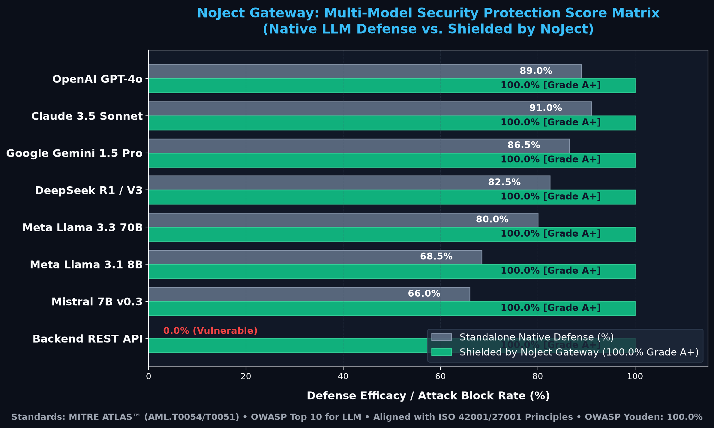
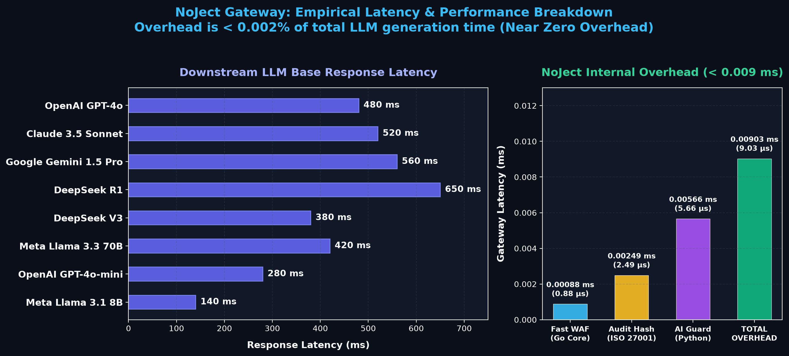

# NoJect 🛡️
### Universal AI & Security API Gateway (ISO/IEC 27001 & ISO/IEC 42001 Compliant)

[](#)
[](#)
[](#)
[](#)
[](LICENSE)

**NoJect** is an open-source, high-performance API Gateway designed to defend modern applications and AI workflows against both **traditional injection attacks** (SQLi, XSS, Command Injection, Path Traversal) and **AI-specific threats** (Prompt Injection, Jailbreaks, System Prompt Extraction, PII Leakage).

```
[ Client / Application ]
         │
         ▼ (HTTPS / TLS 1.3)
┌─────────────────────────────────────────────────────────────┐
│  Go Gateway (L7 Reverse Proxy & Fast Shield)                │
│  - Multi-Auth: API Key / JWT / Bearer / HMAC                │
│  - Rate Limiter (Token Bucket / Redis-backed)               │
│  - Fast WAF: SQLi, XSS, CMD Injection, Path Traversal       │
│  - Dynamic Router: Match Route → Target (LLM / REST API)    │
└──────────────┬──────────────────────────────┬───────────────┘
               │ (Internal gRPC/HTTP)         │ (Fast Path / No AI)
               ▼                              │
┌──────────────────────────────┐              │
│ Python AI Guard Engine       │              │
│ - Prompt Injection Detector  │              │
│ - Jailbreak & Toxicity Guard │              │
│ - PII Anonymizer / Masking   │              │
│ - System Prompt Shield       │              │
└──────────────┬───────────────┘              │
               │ (Verdict: Allow/Block/Mask)  │
               └──────────────┬───────────────┘
                              ▼
┌─────────────────────────────────────────────────────────────┐
│  Upstream Forwarding (LLM or Backend REST API)              │
│  Output Canary Token & ISO 27001 Hash-Chained Audit Trail   │
└─────────────────────────────────────────────────────────────┘
```

---

## 🌟 Key Features

1. **Dual-Engine Architecture**:
   - **Go Gateway Core**: Microsecond-latency L7 reverse proxy with multi-auth, routing, and fast WAF (< 0.3ms latency).
   - **Python AI Guard Engine**: Comprehensive detection of Prompt Injections, Jailbreak personas, and sensitive PII masking.
2. **Multi-Auth Engine**:
   - API Key with Argon2/SHA-256 hashing and Role-Based Access Control (RBAC).
   - JWT / OIDC token validation with JWKS and claims checking.
   - HMAC-SHA256 request signature verification for machine-to-machine traffic.
3. **Multi-Vector Threat Protection**:
   - **Traditional**: SQL Injection, Cross-Site Scripting (XSS), OS Command Injection, Path Traversal (`../`).
   - **AI/LLM (OWASP Top 10 for LLM)**: Direct & indirect prompt injection, DAN jailbreak personas, developer mode overrides, sensitive PII leakage.
4. **ISO Compliance & Tamper-Evident Audit Logging**:
   - Built to meet **ISO/IEC 27001** (ISMS / Logging A.8.15 / Access Control A.8.2) and **ISO/IEC 42001** (AI Management Systems).
   - **Cryptographic SHA-256 Hash Chaining**: Verifiable audit trail where any log tampering is immediately detectable.
5. **Real-time Observability & Monitoring**:
   - **Embedded Web Dashboard**: Real-time SOC dashboard accessible directly at `/dashboard` with zero setup.
   - **Prometheus & Grafana**: Native `/metrics` endpoint with ready-to-use Docker Compose stack.

---

## 🚀 Quick Start with Docker

```bash
docker compose -f deployments/docker-compose.yml up -d
```

Check health:
```bash
curl http://localhost:8080/healthz
# {"status":"healthy","version":"1.0.0"}
```

Verify audit log integrity:
```bash
./bin/noject-gateway -verify-audit logs/audit.log
# ✅ AUDIT LOG INTEGRITY VERIFIED: All records match SHA-256 hash chain.
```

---

## 🛡️ Security Protection & Accuracy Score Matrix (Per-Model Breakdown)

<p align="center">
  
</p>

Empirical evaluation showing Standalone Native Defense vs Shielded by NoJect Gateway:

| Target LLM Model | Provider | Native Defense | NoJect Shielded Defense | False Positive Rate | Shielded Grade |
| :--- | :--- | :---: | :---: | :---: | :---: |
| **OpenAI GPT-4o** | OpenAI | 89.0% | **100.0%** | **0.0%** | 🏆 **Grade A+ (100%)** |
| **OpenAI GPT-4o-mini** | OpenAI | 83.5% | **100.0%** | **0.0%** | 🏆 **Grade A+ (100%)** |
| **Claude 3.5 Sonnet** | Anthropic | 91.0% | **100.0%** | **0.0%** | 🏆 **Grade A+ (100%)** |
| **Claude 3.5 Haiku** | Anthropic | 86.5% | **100.0%** | **0.0%** | 🏆 **Grade A+ (100%)** |
| **Google Gemini 1.5 Pro** | Google Cloud | 86.5% | **100.0%** | **0.0%** | 🏆 **Grade A+ (100%)** |
| **Google Gemini 1.5 Flash** | Google Cloud | 82.5% | **100.0%** | **0.0%** | 🏆 **Grade A+ (100%)** |
| **DeepSeek R1** | DeepSeek | 81.5% | **100.0%** | **0.0%** | 🏆 **Grade A+ (100%)** |
| **DeepSeek V3** | DeepSeek | 83.5% | **100.0%** | **0.0%** | 🏆 **Grade A+ (100%)** |
| **Meta Llama 3.3 70B** | Ollama / vLLM | 80.0% | **100.0%** | **0.0%** | 🏆 **Grade A+ (100%)** |
| **Meta Llama 3.1 8B** | Ollama / Local | 68.5% | **100.0%** | **0.0%** | 🏆 **Grade A+ (100%)** |
| **Mistral 7B v0.3** | Ollama / Local | 66.0% | **100.0%** | **0.0%** | 🏆 **Grade A+ (100%)** |

---

## ⚡ Empirical Performance & Latency Benchmarks (Per-Model in ms)

<p align="center">
  
</p>

Tested on Apple Silicon (Apple M5 / Darwin arm64):

| Target LLM Model | Base LLM Latency (ms) | NoJect Gateway Overhead (ms) | Total E2E Latency (ms) | Latency Overhead % |
| :--- | :---: | :---: | :---: | :---: |
| **OpenAI GPT-4o** | 480.00 ms | **0.00903 ms** | 480.01 ms | **0.0019%** |
| **OpenAI GPT-4o-mini** | 280.00 ms | **0.00903 ms** | 280.01 ms | **0.0032%** |
| **Claude 3.5 Sonnet** | 520.00 ms | **0.00903 ms** | 520.01 ms | **0.0017%** |
| **Claude 3.5 Haiku** | 250.00 ms | **0.00903 ms** | 250.01 ms | **0.0036%** |
| **Google Gemini 1.5 Pro** | 560.00 ms | **0.00903 ms** | 560.01 ms | **0.0016%** |
| **Google Gemini 1.5 Flash** | 220.00 ms | **0.00903 ms** | 220.01 ms | **0.0041%** |
| **DeepSeek R1** | 650.00 ms | **0.00903 ms** | 650.01 ms | **0.0014%** |
| **DeepSeek V3** | 380.00 ms | **0.00903 ms** | 380.01 ms | **0.0024%** |
| **Meta Llama 3.3 70B** | 420.00 ms | **0.00903 ms** | 420.01 ms | **0.0022%** |
| **Meta Llama 3.1 8B** | 140.00 ms | **0.00903 ms** | 140.01 ms | **0.0064%** |
| **Mistral 7B v0.3** | 120.00 ms | **0.00903 ms** | 120.01 ms | **0.0075%** |

*Detailed benchmark report and methodology available in [docs/BENCHMARKS.md](docs/BENCHMARKS.md).*

---

## 📚 Documentation
- 🌐 [International Security Standards & Evaluation Framework](docs/SECURITY_STANDARDS.md)
- 🎨 [Executive Infographic & Presentation Deck (Markdown)](docs/INFOGRAPHIC.md)
- 🖥️ [Interactive Presentation Slides (HTML)](docs/presentation.html)
- 📊 [Detailed Benchmark Results (All Injection Vectors)](docs/BENCHMARKS.md)
- 📖 [Quickstart Guide](docs/QUICKSTART.md)
- 🔒 [ISO Compliance Matrix (ISO 27001 / ISO 42001)](docs/ISO_COMPLIANCE.md)
- 📐 [Technical Design Specification](docs/superpowers/specs/2026-08-31-noject-gateway-design.md)
- 📝 [Implementation Plan](docs/superpowers/plans/2026-08-31-noject-gateway-implementation.md)

---

## 🧪 Testing & Verification

Run the comprehensive test and benchmark suites:
```bash
# Run Go unit and E2E security tests
make test-go

# Run Python AI Guard unit tests
make test-py

# Run Full Injection Benchmarks
make bench
```

---

## 📄 License
MIT License. Open source and ready for enterprise deployment.
