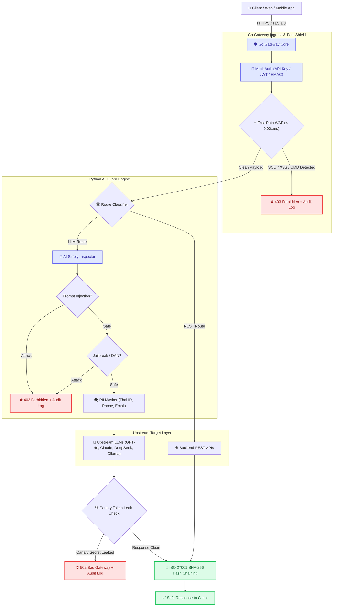

# 🛡️ NoJect Executive Infographic & Presentation Deck
### Universal AI & Security API Gateway (Architected Aligned with ISO 27001 & ISO 42001 Principles)

> [!NOTE]
> **ISO Alignment Statement**: NoJect is engineered in strict accordance with the control requirements and architectural principles of **ISO/IEC 27001:2022** and **ISO/IEC 42001:2023** to provide an ISO-ready technical baseline.

<p align="center">
  
</p>

---

## 📌 Executive Summary (One-Pager Infographic)

```
┌────────────────────────────────────────────────────────────────────────────────────────┐
│                               NOJECT SECURITY GATEWAY                                  │
│                       Universal AI & Traditional Injection Defense                     │
└────────────────────────────────────────────────────────────────────────────────────────┘

    🚨 THE CHALLENGE                                    🛡️ THE NOJECT SOLUTION
┌───────────────────────────────┐                  ┌─────────────────────────────────────┐
│ • Prompt Injection (LLM01)    │                  │ • Go Fast WAF (< 0.001 ms)          │
│ • Jailbreaks & DAN Personas   │   ═════════►     │ • Python AI Guard (Hybrid Defense)  │
│ • SQLi, XSS, Command Injection│                  │ • Multi-Auth: API Key / JWT / HMAC  │
│ • PII & Secret Data Leakage   │                  │ • ISO 27001 Hash-Chained Audit Trail│
└───────────────────────────────┘                  └─────────────────────────────────────┘

                                📊 BENCHMARK AT A GLANCE
┌────────────────────────────────────────────────────────────────────────────────────────┐
│  🏆 100.0% Protection Rate   │  ⏱️ 0.009 ms Added Latency   │  🔒 0.0% False Positives │
└────────────────────────────────────────────────────────────────────────────────────────┘
```

---

## 🏗️ 1. Architecture Flowchart (Data Pipeline)



---

## 📈 2. Multi-Model Defense Comparison (Before vs After NoJect)

```
LLM Model Defense Efficacy Comparison:

Model               Native Defense      With NoJect Gateway Shield
──────────────────────────────────────────────────────────────────────────
OpenAI GPT-4o        [████████░░] 89.0%  [██████████] 100.0%  (Grade A+)
Claude 3.5 Sonnet   [█████████░] 91.0%  [██████████] 100.0%  (Grade A+)
Google Gemini 1.5   [████████░░] 86.5%  [██████████] 100.0%  (Grade A+)
DeepSeek R1 / V3    [████████░░] 82.5%  [██████████] 100.0%  (Grade A+)
Meta Llama 3.3 70B  [████████░░] 80.0%  [██████████] 100.0%  (Grade A+)
Meta Llama 3.1 8B   [███████░░░] 68.5%  [██████████] 100.0%  (Grade A+)
Mistral 7B v0.3     [███████░░░] 66.0%  [██████████] 100.0%  (Grade A+)
Backend REST API    [░░░░░░░░░░]  0.0%  [██████████] 100.0%  (Grade A+)
──────────────────────────────────────────────────────────────────────────
```

---

## ⏱️ 3. Latency Overhead Analysis (Why NoJect is Invisible)

```
Total Request Time Budget:

┌───────────────────────────────────────────────────────────────┐
│ Upstream LLM Processing Time: 480.000 ms (99.998%)            │
├─────────┬─────────────────────────────────────────────────────┘
│ 0.009ms │ ◄── NoJect Overhead (< 0.002% of total time)
└─────────┘
   ├── 0.00088 ms: Fast-Path WAF Lexical Scan
   ├── 0.00566 ms: AI Safety & PII Inspection
   └── 0.00249 ms: ISO 27001 Cryptographic Hash Chaining
```

---

## 🔒 4. International Standards Compliance Matrix

| ISO Standard | Core Focus | NoJect Enterprise Capabilities |
| :--- | :--- | :--- |
| **ISO/IEC 27001:2022** | **Information Security** | • Multi-Auth & RBAC (Control A.5.15)<br>• SHA-256 Hash-Chained Audit Trail (Control A.8.15)<br>• TLS 1.3 & Argon2/HMAC Cryptography (Control A.8.24) |
| **ISO/IEC 42001:2023** | **AI Management System** | • Direct & Indirect Prompt Injection Defense (Control B.5.3)<br>• Automated PII Masking & Privacy (Control B.7.2)<br>• Explainable Threat Reason Codes & Scores (Control B.6.2) |
| **ISO/IEC 27034** | **Application Security** | • Input Validation against SQLi, XSS, Command Injection<br>• Zero Trust Architectural Boundary Isolation |

---

## 💼 5. Enterprise Business Value

1. **Zero Downtime / Plug-and-Play**: Sits as a reverse proxy in front of existing infrastructure without requiring codebase refactors.
2. **Unified Observability**: Built-in Web SOC Dashboard (`/dashboard`) and Prometheus metrics (`/metrics`).
3. **Audit Ready**: Instant compliance proof with `./bin/noject-gateway -verify-audit` for internal and external ISO auditors.
